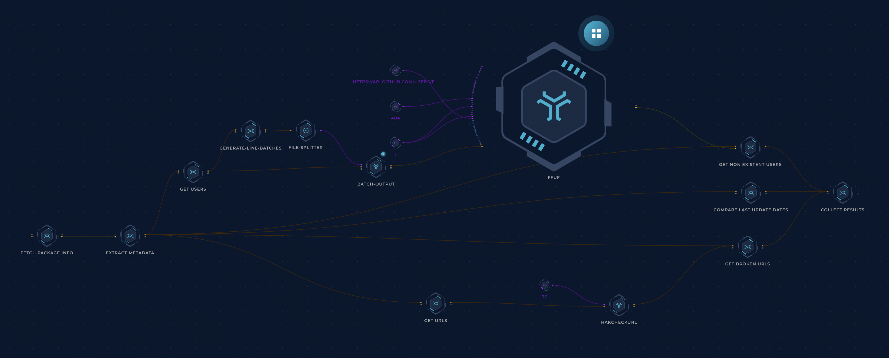

<h1 align="center">Packages </h1>
<h3 align="center">Automated compromise detection of the world's most popular packages</h3>

For each package registry, 3 files are generated:
- `non_existent_users.csv`: Packages that point to a GitHub repository whose owner doesn't exist anymore: [PyPI](pypi/non_existent_users.csv), [npm](npm/non_existent_users.csv)
- `suspicious_updates.csv`: Packages that have been updated on the package repository without a corresponding update to the code repository's default branch: [PyPI](pypi/suspicious_updates.csv), [npm](npm/suspicious_updates.csv)
- `broken_urls.csv`: Packages that have a broken URL anywhere in their description, homepage, docs URL, bugtrack URL, etc: [PyPI](pypi/broken_urls.csv), [npm](npm/broken_urls.csv)

## How it Works
A [Trickest](https://trickest.com) workflow gets the initial dataset from:
- [hugovk's Top PyPI packages project](https://hugovk.github.io/top-pypi-packages/) for PyPI packages.
- [anvaka's npmrank project](https://github.com/anvaka/npmrank) - [Example](https://gist.github.com/anvaka/8e8fa57c7ee1350e3491) for npm packages.

Then, it performs multiple checks to find any red flags that could indicate that a package is (or can be) compromised.

### TB; DZ (Too big; didn't zoom)
- The initial PyPI dataset is collected from the [Top PyPI packages project](https://hugovk.github.io/top-pypi-packages/), which contains a list of PyPI's top 5000 most downloaded packages, updated monthly. (Thanks, [@hugovk](https://github.com/hugovk)!)
- The npm dataset is collected using the [npmrank project](https://gist.github.com/anvaka/8e8fa57c7ee1350e3491) (Thanks, [@anvaka](https://github.com/anvaka)!) which collect the:
    1. Top 1,000 most depended-upon packages
    2. Top 1,000 packages with the largest number of dependencies
    3. Top 1,000 packages with the highest PageRank score

    - When merged and deduplicated, they amount to ~2500 packages across all categories.
- The package names are passed to the `extract-metadata` node which collects 4 categories of info about each package:
    - The latest package release date
    - The GitHub repository connected to the package
    - The repository's latest commit date
    - The URLs that the package points to anywhere
- This node branches off into 3 checks:
    - The package's latest release date and repository's latest commit date are compared. If a package version has been released _after_ the latest commit date, the package is flagged.
        - Example: The `ctx` package (now deleted) had its [last commit in 2014](https://github.com/figlief/ctx/commits/master) but a [new version was released in 2022](https://web.archive.org/web/20220519184823/https://pypi.org/project/ctx/#history) which [turned out to be malicious](https://www.reddit.com/r/Python/comments/uwhzkj/i_think_the_ctx_package_on_pypi_has_been_hacked/).
    - GitHub usernames are extracted from the repository URLs and passed to [ffuf](https://github.com/ffuf/ffuf) which queries the GitHub API to check if any usernames don't exist anymore (Thanks [@joohoi](https://github.com/joohoi)!)
    - The package's URLs are passed to [hakcheckurl](https://github.com/hakluke/hakcheckurl) to check if any URLs are broken and could be taken over. (Thanks [@hakluke](https://github.com/hakluke))
- In the end, the results of these checks are matched back to their packages and pushed to this repository.
- The workflow is scheduled to run constantly.

## Contribution
All contributions are welcome! Got an idea for another check? Know a way to make a check more accurate? Feel free to create a new ticket via [GitHub issues](https://github.com/trickest/packages/issues), tweet at us [@trick3st](https://twitter.com/trick3st), or join the conversation on [Discord](https://discord.gg/7HZmFYTGcQ).

## Build your own workflows!
We believe in the value of tinkering. Sign up for a demo on [trickest.com](https://trickest.com) to customize this workflow to your use case, get access to many more workflows, or build your own from scratch!

